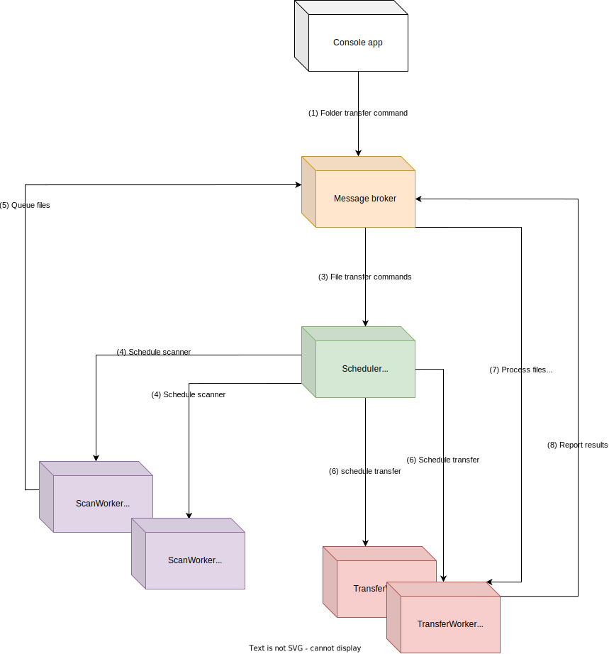

# File transfer
Transferring files from one folder to another asynchronously

## Assumptions
- When a file is transferred, a copy of this file is placed under the new folder, keeping the original intact.
- Files of the same type are processed sequentially, even if issued from different folders.
- A message queue is issued for each file type (per file extension). Each queue is processed by one worker process.
- When transferred files from subfolders, the subfolder structure is not maintained. 
All files would be copied into the destination folder without taking into account the subfolder structure.

## Architecture



```
├───RdxFileTransfer
│   ├───Options
├───RdxFileTransfer.EventBus
│   ├───BusEvents
│   ├───Constants
│   ├───Enums
│   └───RabbitMq
└───RdxFileTransfer.Scheduler
    ├───Options
    ├───Orchestrator
    └───Workers
```

- RdxFileTransfer : receives input from users and queue it for background processing.

- RdxFileTransfer.EventBus: a common interface used for message transporting.
The current implementation only provides RabbitMq, but it is possible to extend the library to support different types of event bus (rabbitmq, azure...).

- RdxFileTransfer.Scheduler: receives messages from  the task queue (transfer command from users) and schedule workers to process these commands.
The scheduler runs in the a separate process and listens to the task queue. When a message arrives:
    1) Create a worker process to scan the folder.
    2) The scanner creates a queue for each file extension and queue each file to its respective queue.
    3) The scheduler then creates a worker process for each file extention (if there is no worker currently handling this file type).
    4) These transfer workers listen to the file queues and transfer files as they process these events.

## Message queue structure
<table border="0">
    <tr>
        <td><b>Queue</b></td>
        <td><b>Events</b></td>
    </tr>
    <tr>
        <td>transfer_jobs</td>
        <td>User commands to transfer folders.</td>
    </tr>
    <tr>
        <td>success</td>
        <td>Successfully transferred files.</td>
    </tr>
    <tr>
        <td>error</td>
        <td>All errors of reading and copying files or handling folders.</td>
    </tr>
    <tr>
        <td>no_ext</td>
        <td>Files without extension waiting to be transferred</td>
    </tr>
    <tr>
        <td>docx, pdf, txt...</td>
        <td>Files with a specifique extension waiting to be transferred</td>
    </tr>
</table>

**Message queue behavior**
- Queue is durable so events are not lost in case of abrupt shutdown.

- A message is removed from queue once a worker starts reading it. This is only to simplify our task flows, not to avoid race condition. Because we only have on worker per queue so a race condition should not happen.

## How to run the application
Run the first script to setup environment, you must leave the console open so the scheduler can process messages.

```sh
setup
```
In another console windows, run transfer script to start application:

```sh
transfer [sourceFolder] [destinationFolder]
```

- The ```setup``` scripts:
    1) Build projects in the solution and publish it to Release folder.
    2) Set environments variables to default values.
    3) Starts a RabbitMq server in container, listens at port 1978.
    4) Starts the scheduler.

- The ```transfer``` scripts runs RdxFileTransfer application which then starts listen to user input.

- The default event bus is RabbitMq. You can choose the event bus using -b option when running RdxFileTransfer and RdxFileTransfer.Scheduler or by setting environment variable 'eventbus'.

<table border="0">
 <tr>
    <td><b>RdxFileTransfer.Scheduler Option</b></td>
    <td><b>Usage</b></td>
 </tr>
 <tr>
    <td>-b, --bus</td>
    <td>Event bus, only at start up</td>
 </tr>
</table>

<table border="0">
 <tr>
    <td><b>RdxFileTransfer Option</b></td>
    <td><b>Usage</b></td>
 </tr>
 <tr>
    <td>-b, --bus</td>
    <td>Event bus, only at start up</td>
 </tr>
  <tr>
    <td>-s, --source</td>
    <td>Source folder, when promted at run time</td>
 </tr>
   <tr>
    <td>-d, --destination</td>
    <td>Destination folder, when promted at run time</td>
 </tr>
</table>

## Notices
- Linux supported but not fully tested.

## Further topics to explore
- Implement health monitor and autorecovery.
- Extend to support other types of event bus (azure bus, ActiveMq...).
- Explore IOrchestrator to support other task flows.
- Process error and success queues.
- Integration tests.
- More unit tests.

## Dependencies
- RabbitMq
- Docker
